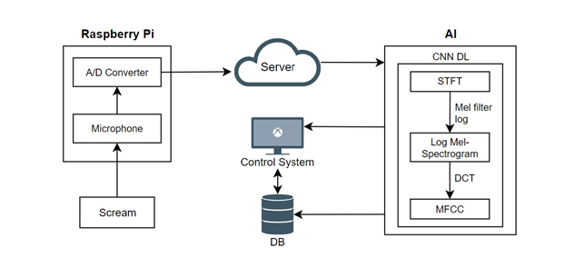
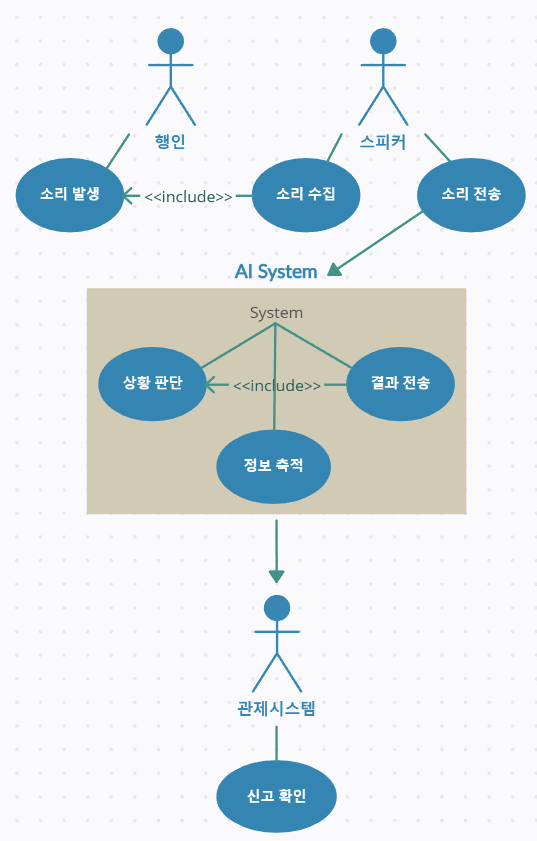
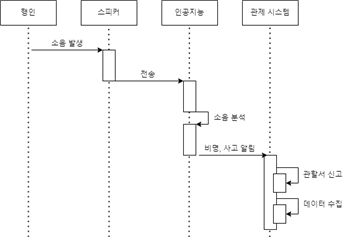
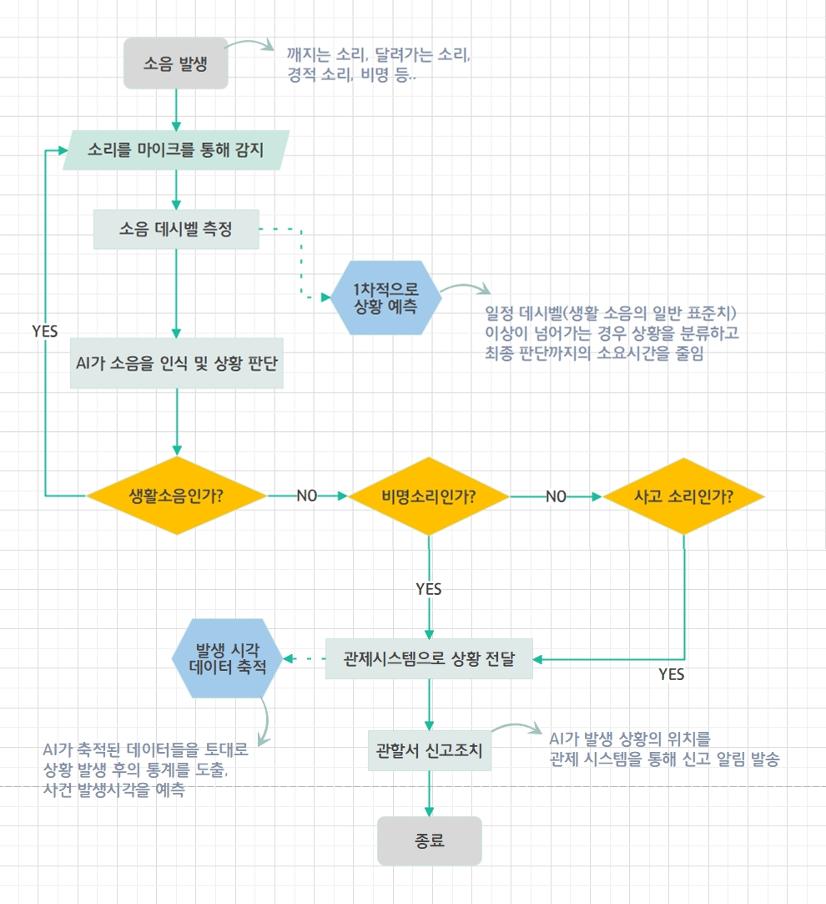
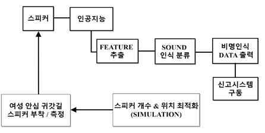
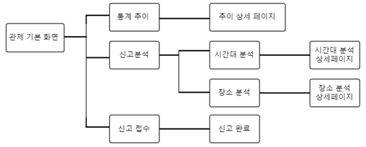
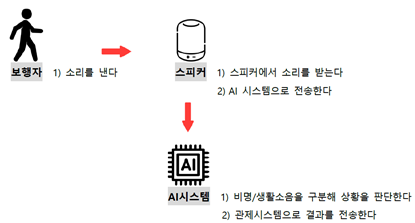
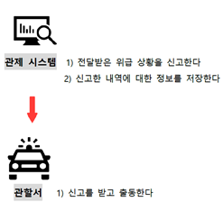
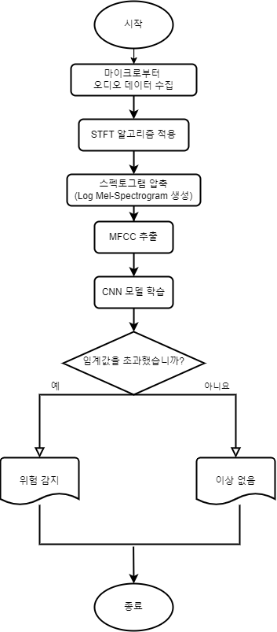
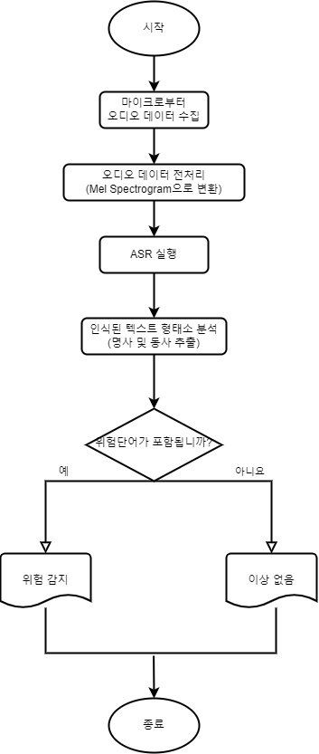

# 여성 안심 귀갓길 음성/음향 인식 신고 시스템 🎙️

## I. 프로젝트 개요

### 1. 프로젝트 소개

#### 1) 비명을 인식한 인공지능이 위험 상황 여부를 판단해 자동으로 신고하는 AIoT
- **제안 배경**
  - 기존의 안전 시스템은 실제 위급 상황 발생 시 즉각 대처가 어려움.
  - CCTV의 영상 관제는 사각지대가 존재하고, 객체 간의 간섭이 발생할 경우 인식이 어려움.
  - 비상벨은 대부분 활성화되어 있지 않으며, 설치된 장소가 매우 제한적임.
  - 피해자가 범죄에 노출되었을 때 직접 신고가 어렵고, 상황 전달에 한계가 있음.

- **주요 내용**
  - 여성 안심 귀갓길에서 발생하는 소리를 **라즈베리파이 마이크**가 실시간으로 인식.
  - 데이터를 전달받은 **인공지능**이 소음의 종류를 판단 및 분석.
  - **실시간 상황 파악 및 자동 신고**를 진행.
  - 사용자가 스스로 조치를 취하지 않아도 신고가 이루어져 여성들의 불안감을 해소.
  - 신고 내역을 활용하여 **범죄 현황 대시보드**를 제공, 안전 정책 수립에 기여 가능.
    
---

## II. 개발 배경 및 필요성

### 1. 배경 및 동기
| **사례** | **내용** |
|----------|----------|
| **사례 1** | - 일부 여성안심 귀갓길이 관리 부실로 인해 제대로 작동하지 않거나 설치조차 되지 않은 곳이 많음.  - 경찰청 자료에 따르면, 전국 1,985개 안심 귀갓길 중:    - 노면 표시가 없는 곳: **928개**    - 비상벨이 없는 곳: **781개**  - 비상벨이 설치된 경우에도 눈에 띄지 않는 곳에 위치.  *출처: [‘안심’없는 여성안심 귀갓길 관리대책 서둘러라 (금강일보, 2022.02.08)]* |
| **사례 2** | - 아동 성범죄자 출소 후 거주지인 안산시 단원구 여성안심 귀갓길 총 10개를 점검한 결과:    - 녹슨 CCTV 및 스피커    - 일부 비상벨은 망가져 있음.  - 여성 주거 침입 범죄가 가장 높은 서울시의 경우, 비상벨과 CCTV조차 없는 상태.  *출처: [조두순 거주지 ‘안심 귀갓길’ 점검...“CCTV 없고 비상벨은 먹통” (YTN, 2020.11.17)]* |

---

### 2. 목적 및 필요성
| **구분**      | **내용** |
|---------------|----------|
| **목적**      | - 기존 방범 기기의 한계를 극복하고, **소리 기반 AIoT**로 상황 판단 및 자동 신고를 가능하게 함.  - 여성안심 귀갓길의 미흡한 안전조치를 보완하고, 사용자 개입 없이도 신고 가능한 시스템 구축. |
| **필요성**    | - 기존 안전 시스템은 다음과 같은 한계를 가짐:   1. 피해자가 스스로 신고할 수 없는 상황 발생.   2. CCTV는 사각지대 문제 및 실시간 관제 어려움.  - AIoT 기술을 통해 자동화된 신고 시스템 도입으로 여성의 불안감을 해소할 수 있음. |

---

### 3. 프로젝트 특·장점
| **항목**                 | **기존 시스템의 문제점**                                         | **본 프로젝트의 개선 및 차별성** |
|--------------------------|----------------------------------------------------------------|----------------------------------|
| **피해자 상황 전달 문제** | - 피해자가 유연한 대처를 하기 어렵고, 상황 전달에 한계가 있음. | - 피해자가 직접 조치를 취하지 않아도 **자동 신고**가 가능. |
| **CCTV 사각지대**         | - CCTV 관제는 사각지대를 커버하지 못해 대응이 늦어짐.         | - 비명 인식 및 GPS 활용으로 사각지대 문제를 보완. |
| **개인정보 유출 위험**    | - 기존 IoT는 모든 데이터를 서버에 저장해 개인정보 유출 위험.    | - **위험 상황**으로 판단된 데이터만 저장하여 보안 문제 해결. |
| **활용 범위 제한**        | - 비상벨 및 CCTV는 설치된 장소 외에는 활용 불가.               | - **주차장, 골목길, 공중화장실** 등 설치 어려운 공간에서도 사용 가능. |

---

## III. 프로젝트 구성도

### 1. 시스템 구성도

#### 1) 시스템 구성도
- **설명**: 라즈베리파이와 AI모뗼과의 시스템 구성도.
- **이미지**:
  

---

#### 2) 유스케이스
- **설명**: 소리 발생부터 신고 알림 전송까지의 시나리오 흐름을 도식화한 다이어그램.
- **이미지**:
  

---

#### 3) 순차 다이어그램
- **설명**: 객체 간의 관계와 메시지 교환을 나타내는 비명 인식 시의 처리 과정 흐름도.
- **이미지**:
  

---

#### 4) 플로우 차트
- **설명**: 소음 발생에서부터 관할서의 신고 조치까지 YES/NO 판단에 따라 진행되는 기능과 순서 과정을 나타낸 차트.
- **이미지**:
  

---

### 2. AIoT 기기 메뉴 구성도
- **설명**: AIoT 기기의 사용자 인터페이스 및 기능 구성에 대한 메뉴 다이어그램.
- **이미지**:
  

---

### 3. 관제 시스템 메뉴 구성도
- **설명**: 관제 시스템에서 제공되는 주요 메뉴와 기능 구성에 대한 다이어그램.
- **이미지**:
  

---

### 4. 서비스 흐름도
#### 1) AI 시스템
- **설명**: AI 시스템이 소음을 처리하고 결과를 분석하는 과정을 단계별로 도식화.
- **이미지**:
  

#### 2) 관제 시스템
- **설명**: 신고 접수 후 관할 기관에서 처리하는 프로세스를 시각화한 흐름도.
- **이미지**:
  

---

## 2. 프로젝트 기능
### **전체 기능 목록**

| **구분** | **기능**          | **설명**                                                                 |
|----------|-------------------|-----------------------------------------------------------------------|
| **S/W**  | 음향 저장          | 라즈베리파이 마이크를 통해 인식한 소리를 `wav` 형식으로 저장                                   |
|          | 비명 인식          | 인공지능이 환경 소음과 비명을 구분하여 인식하고 관제 시스템으로 신고 알림 전송                           |
|          | 관제 시스템         | - 신고정보에 대한 데이터를 통계 도출 및 시각화하여 제공 - 방범 시스템에 대한 추가 정보 제공 - 관할서 정보 제공 |
| **H/W**  | 라즈베리파이        | IoT 시스템 구동 하드웨어                                                       |
|          | ReSpeaker2-Mics Pi HAT | 주변 사운드 인식                                                              |
|          | GPS               | 비명 발생 위치 파악                                                           |

---

### **S/W 주요 기능**

| **기능**           | **설명**                                                                                                      |
|--------------------|-----------------------------------------------------------------------------------------------------------------|
| **인공지능 모델**   | 학습 피처 추출: 각 비명에 따른 상황을 분류하기 위한 특징을 추출함. FFT 알고리즘과 MFCC 알고리즘을 활용하여 특징을 명확하게 함. |
| **음향 분류 모델**   | 수집된 사운드가 비명인지 생활 소음인지를 분류하여 위험 상황 여부를 판단함.                                        |
| **음성 분류 모델 (OpenAI Whisper)** | 인식된 음성의 문장과 신고가 될 음성의 문장을 설정하여 비교 분석 후 위험 상황을 판단함. 형태소 분석을 통해 동사와 명사를 추출하고 불필요한 단어를 제거하여 정확도를 높임. |
| **관제 시스템**     | 신고 알림을 팝업창을 통해 수신하고, 위치 정보를 공유받음. 범죄 현황에 대한 다양한 자료를 대시보드를 통해 제공함. |

### **H/W 주요 기능**

| **기능/부품**             | **설명**                                                       |
|--------------------------|---------------------------------------------------------------|
| **라즈베리파이 4B**       | IoT 기기 구동 본체, 우분투 리눅스 GUI 환경에서 작동            |
| **ReSpeaker 2-Mics Pi HAT** | 라즈베리파이용 확장 보드 마이크, 소리를 인식하고 저장       |
| **GPS 모듈**              | 소리가 수집된 위치 정보 파악                                  |

---
## 3. 주요 적용 기술

### 1) S/W

#### ○ 사운드 인식 및 분류 AI
- 컴퓨터가 인식할 수 있도록 마이크에 부착된 A/D 컨버터를 사용해 소리의 파형을 디지털 신호로 변환합니다.
- 환경에 따라 소음의 데시벨이 달라지므로, 소리의 인식 반경은 신호 대 잡음비(SNR)에 따라 조정됩니다.
- 잡음에 의해 오염된 음성 신호는 각 프레임으로 분리되어 해밍창에 통과시킨 후 고속 푸리에 변환(FFT)을 통해 주파수 이미지를 Spectrogram 파형으로 변환합니다.
- 이 데이터를 특징 벡터(feature)화 해주는 MFCC 알고리즘을 적용하고, 파이썬의 `librosa` 라이브러리를 사용하여 이를 추출합니다.
- 소리 데이터를 발견하고 노이즈를 제거하는 전처리 과정을 거쳐, 최종적으로 학습 피처를 추출합니다.
- 추출된 피처를 바탕으로 CNN 신경망을 사용하여 AI 모델을 학습시킵니다.
- 인식된 사운드를 통해 인공지능이 단순 생활 소음인지 비명소리인지를 판단하고, 상황에 맞게 분류합니다.
   

  
  

- **데이터셋**: 
  - 학습에 활용한 데이터셋은 유튜브 및 무료 사운드 제공 사이트에서 정제하여 구성한 파일과 AI-Hub에서 다운로드한 파일을 사용했습니다.
  - 각 WAV 파일은 3초 단위로 고정하고 라벨링 파일을 생성하여 인공지능 학습에 활용합니다.
  - 학습 데이터의 양을 증가시키기 위해 3,000개의 데이터를 12,000개로 증강하여 사용했습니다.

#### ○ 데이터 통계 대시보드
- 수집한 데이터를 활용하여 이상 음원 다발 발생 장소와 특정 발생 시간대, 신고 접수 데이터 등을 기반으로 DB를 구축합니다.
- 데이터 마이닝의 연관분석 알고리즘을 활용하여, 이상 음원 다발 발생 장소 및 특정 발생 시간대와 관련된 통계를 추출합니다.
- 이를 바탕으로 범죄 발생 예측 테이블을 작성하고, 대시보드를 통해 정보를 제공합니다.

#### ○ 자동 신고
- 분석 완료된 데이터에 기반하여 위급상황으로 판단되면, 인공지능이 해당 소리가 수집된 위치 반경 내의 관할서 혹은 경찰서의 관제 시스템에 자동으로 신고합니다.

### 2) H/W

#### ○ 라즈베리파이
- 비명 인식기 스피커에 내장된 IoT 기기의 본체로, `라즈베리파이` 4B 모델을 사용합니다.
- 듀얼 마이크 확장 보드인 `ReSpeaker 2-Mics Pi HAT`을 사용하여 소리를 인식하고 WAV 파일 형식으로 저장합니다.

#### ○ GPS 모듈
- 비명이 발생한 위치 정보를 파악하기 위해 `GPS 모듈`을 설치합니다.
- 비명 발생 위치와 주변 관할서 위치를 파악하는 데 사용되며, 사건의 정확한 위치를 추적하여 신고 시 중요한 정보를 제공합니다.

